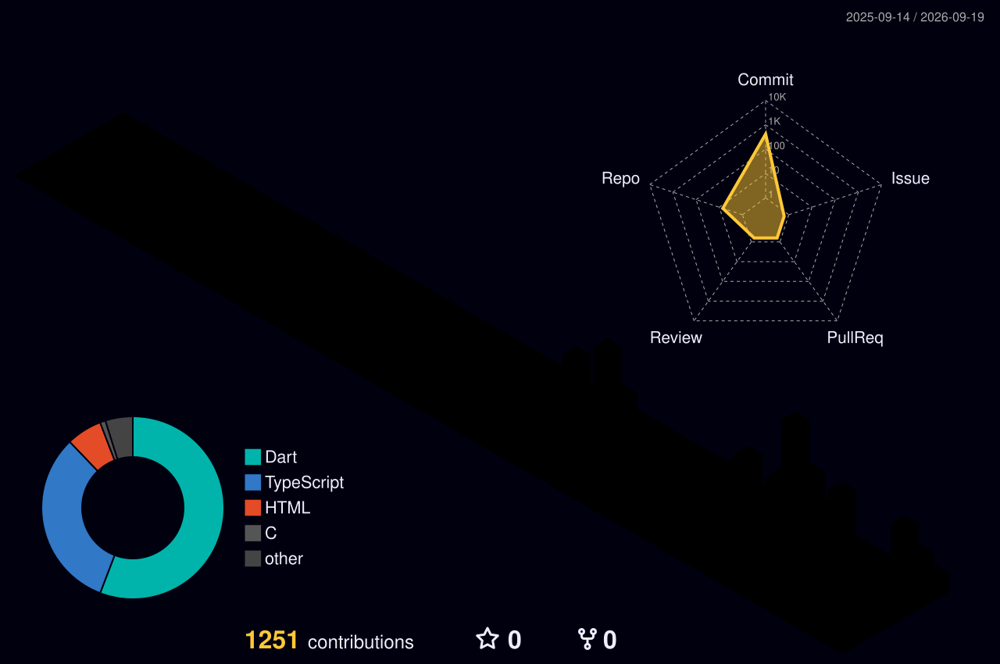

<!--
  ===============================================================
  GitHub Profile README — Poasherkir (Malik Boudine)
  Setup + maintenance notes live in SETUP.md

  PALETTE (keep these three in sync everywhere):
    violet  #7B2FF7      pink  #F72585      cyan  #00D9FF
    ground  #0D1117 (GitHub dark)
  Card services all use theme=radical, which is built on the same
  pink/cyan pair — swap the theme and the page stops matching.

  Deliberately contains no repo listings. GitHub's pinned
  repositories render directly below and stay current on their own.

  GOTCHAS, both learned the hard way — see SETUP.md step 8:
   1. Never put a raw "&" (%26) in a capsule-render text=/desc=.
      It interpolates unescaped, producing invalid XML that browsers
      refuse to render while curl still reports a healthy 200.
   2. readme-typing-svg takes ONE colour. A comma-separated list is
      silently ignored and it falls back to default blue.
  ===============================================================
-->

<!-- ─────────────  HEADER  ───────────── -->

  

  
  
  
  
  

  <a href="#-about-me"><b>About</b></a> &nbsp;•&nbsp;
  <a href="#-how-i-work"><b>How I Work</b></a> &nbsp;•&nbsp;
  <a href="#-tech-stack"><b>Stack</b></a> &nbsp;•&nbsp;
  <a href="#-github-analytics"><b>Analytics</b></a> &nbsp;•&nbsp;
  <a href="#-contribution-graph"><b>Contributions</b></a> &nbsp;•&nbsp;
  <a href="#-lets-connect"><b>Contact</b></a>

<!-- ─────────────  ABOUT ME  ───────────── -->
## 👋 About Me

Computer Science student in **Algeria** 🇩🇿. I build software for the conditions most
apps quietly assume away — no signal, a cheap Android phone, a language that reads
right to left.

&nbsp;📱&nbsp; **Flutter** for mobile — offline-first, encrypted local storage, Arabic RTL as a first-class case rather than an afterthought

&nbsp;🌐&nbsp; **Next.js + TypeScript** for the web — App Router, React 19, Tailwind, and three.js when the page earns it

&nbsp;🐍&nbsp; **Python** for the unglamorous half — importers, scrapers and one-shot migrations that move real archives around

&nbsp;🔒&nbsp; Production work that stays closed — **Briefing Point Go**, **TechSub** and a set of aviation services holding real user data. [Case studies on my site.](https://malikboudine.vercel.app)

&nbsp;🤝&nbsp; Open to **internships**, **freelance work**, and anything offline-first

&nbsp;📫&nbsp; **malikboudinee1e@gmail.com**

 

<!-- ─────────────  HOW I WORK  ───────────── -->
## 🧭 How I Work

<!--
  This replaces the old project catalogue. Pinned repos already show *what* was
  built; this says *how*, which is what a reader can't get by clicking through.
  Keep it to five, and keep every line falsifiable against the code.
-->

> **Offline is the default, not the fallback.**
> I design as if the network will never arrive: sync once, then everything reads from
> local storage — encrypted at rest when it holds anything personal. SQLCipher, not a
> plaintext SQLite file with good intentions.

> **Arabic and French from the first screen.**
> RTL is not a late-stage flag. Layouts that get it retrofitted always leak somewhere
> — a stray `EdgeInsets.only(left:)`, a chevron pointing the wrong way — and every one
> of those is a bug a user notices before I do.

> **The domain layer doesn't know the framework exists.**
> Business rules import nothing from Flutter, nothing from the database, nothing from
> an HTTP client. The interesting logic stays testable without a device, and swapping
> the edges stays cheap.

> **Tests are a gate, not a chore.**
> A strict analyzer that fails on infos, a schema dumped and migration-tested rather
> than assumed, and guards that read constraints back out of the database so a missing
> foreign key can't hide. A demo that only works on my machine isn't finished.

> **Build for the low end.**
> Cheap hardware and slow connections are the target, not the edge case. Bundle size,
> cold-start time and battery are features where I'm from.

<!-- ─────────────  TECH STACK  ───────────── -->
## 🧰 Tech Stack

<!--
  skillicons.dev instead of shields rows: same information, a fraction of the
  vertical space, and it actually looks alive. Every slug below was verified to
  resolve — an unknown slug renders as a blank tile, so check before adding.

  Not listed, because nothing here uses them yet — add the slug if that changes:
  java, ruby, vue, nestjs, tensorflow, aws, gcp, azure, mysql, solidity.
-->

<table align="center">
<tr><td align="center" width="150"><b>Languages</b></td><td>
  
</td></tr>
<tr><td align="center"><b>Mobile</b></td><td>
  
  &nbsp;+ Riverpod · Drift · SQLCipher
</td></tr>
<tr><td align="center"><b>Web</b></td><td>
  
  &nbsp;+ GSAP
</td></tr>
<tr><td align="center"><b>Backend</b></td><td>
  
</td></tr>
<tr><td align="center"><b>Tooling</b></td><td>
  
</td></tr>
</table>

<b>Learning next</b> &nbsp;•&nbsp; deeper Flutter architecture &nbsp;•&nbsp; Postgres row-level security &nbsp;•&nbsp; React Three Fiber &nbsp;•&nbsp; container workflows past <code>docker run</code>

<!-- ─────────────  GITHUB STATS  ───────────── -->
## 📊 GitHub Analytics

<!--
  github-profile-summary-cards, verified serving real numbers.
  Do NOT swap in github-readme-stats: the official instance is 503, and the
  community mirror answers 200 with an SVG reading "Maximum retries exceeded".
  The activity-graph and trophy services are both 402. See SETUP.md step 8.
-->

  

  
  

  
  

  

<!-- ─────────────  CONTRIBUTION GRAPHS  ───────────── -->
## 🐍 Contribution Graph

<!-- Generated by .github/workflows/snake.yml into the `output` branch -->
<picture>
  <source media="(prefers-color-scheme: dark)" srcset="https://raw.githubusercontent.com/Poasherkir/Poasherkir/output/github-snake-dark.svg" />
  <source media="(prefers-color-scheme: light)" srcset="https://raw.githubusercontent.com/Poasherkir/Poasherkir/output/github-snake.svg" />
  
</picture>

<!-- Generated by .github/workflows/3d-contrib.yml and committed to this repo, so
     it can't break the way a third-party image service can -->

  <picture>
    <source media="(prefers-color-scheme: dark)" srcset="./profile-3d-contrib/profile-night-rainbow.svg" />
    <source media="(prefers-color-scheme: light)" srcset="./profile-3d-contrib/profile-green.svg" />
    
  </picture>

  

<!-- ─────────────  SOCIALS  ───────────── -->
## 🤝 Let's Connect

  Open to <b>internships</b>, <b>freelance work</b>, and collaboration on anything offline-first. 
  My work is pinned just below — the deployed pieces and the case studies live on my site.

  
  
  

<!--
  EDIT: add your other profiles here once you want them public. Left out rather
  than shipping dead placeholder links — a badge pointing at
  linkedin.com/in/YOUR-HANDLE is worse than no badge.

  
  
-->

Thanks for scrolling this far. If something here is useful to you, say hello.

