<!--
  ===============================================================
  GitHub Profile README — Poasherkir (Malik Boudine)
  Setup + maintenance notes live in SETUP.md

  PALETTE (keep these three in sync everywhere):
    violet  #7B2FF7      pink  #F72585      cyan  #00D9FF
    ground  #0D1117 (GitHub dark)
  Card services use theme=radical, built on the same pink/cyan pair.

  The header, footer and section dividers are hand-authored animated
  SVGs in assets/ — nebula, starfield, shooting stars, a ringed planet.
  Pure SVG + CSS keyframes, so they animate inside a README  and
  never touch a third-party service. The name, subtitle and the five
  rotating taglines are plain <text> elements in assets/header.svg;
  edit them there.

  Deliberately contains no repo listings. GitHub's pinned
  repositories render directly below and stay current on their own.
  ===============================================================
-->

<!-- ─────────────  HEADER  ───────────── -->

  
  
  

  <a href="#-about-me"><b>About</b></a> &nbsp;✦&nbsp;
  <a href="#-how-i-work"><b>How I Work</b></a> &nbsp;✦&nbsp;
  <a href="#-tech-stack"><b>Stack</b></a> &nbsp;✦&nbsp;
  <a href="#-github-analytics"><b>Analytics</b></a> &nbsp;✦&nbsp;
  <a href="#-contribution-graph"><b>Contributions</b></a> &nbsp;✦&nbsp;
  <a href="#-lets-connect"><b>Contact</b></a>

<!-- ─────────────  ABOUT ME  ───────────── -->
## 🪐 About Me

Computer Science student in **Algeria** 🇩🇿. I build software for the conditions most
apps quietly assume away — no signal, a cheap Android phone, a language that reads
right to left.

&nbsp;📱&nbsp; **Flutter** for mobile — offline-first, encrypted local storage, Arabic RTL as a first-class case rather than an afterthought

&nbsp;🌐&nbsp; **Next.js + TypeScript** for the web — App Router, React 19, Tailwind, and three.js when the page earns it

&nbsp;🐍&nbsp; **Python** for the unglamorous half — importers, scrapers and one-shot migrations that move real archives around

&nbsp;🔒&nbsp; Production work that stays closed — **Briefing Point Go**, **TechSub** and a set of aviation services holding real user data. [Case studies on my site.](https://malikboudine.vercel.app)

&nbsp;🤝&nbsp; Open to **internships**, **freelance work**, and anything offline-first

&nbsp;📫&nbsp; **malikboudinee1e@gmail.com**

 

<!-- ─────────────  HOW I WORK  ───────────── -->
## 🛸 How I Work

<!--
  This replaces the old project catalogue. Pinned repos already show *what* was
  built; this says *how*, which is what a reader can't get by clicking through.
  Keep it to five, and keep every line falsifiable against the code.
-->

> **Offline is the default, not the fallback.**
> I design as if the network will never arrive: sync once, then everything reads from
> local storage — encrypted at rest when it holds anything personal. SQLCipher, not a
> plaintext SQLite file with good intentions.

> **Arabic and French from the first screen.**
> RTL is not a late-stage flag. Layouts that get it retrofitted always leak somewhere
> — a stray `EdgeInsets.only(left:)`, a chevron pointing the wrong way — and every one
> of those is a bug a user notices before I do.

> **The domain layer doesn't know the framework exists.**
> Business rules import nothing from Flutter, nothing from the database, nothing from
> an HTTP client. The interesting logic stays testable without a device, and swapping
> the edges stays cheap.

> **Tests are a gate, not a chore.**
> A strict analyzer that fails on infos, a schema dumped and migration-tested rather
> than assumed, and guards that read constraints back out of the database so a missing
> foreign key can't hide. A demo that only works on my machine isn't finished.

> **Build for the low end.**
> Cheap hardware and slow connections are the target, not the edge case. Bundle size,
> cold-start time and battery are features where I'm from.

<!-- ─────────────  TECH STACK  ───────────── -->
## 🚀 Tech Stack

<!--
  Icon strips are skillicons.dev renders, saved into assets/stack/ so the
  section keeps working when that host is slow or unreachable (it was, once).
  To add a tool: fetch  https://skillicons.dev/icons?i=<slugs>&theme=dark
  and save it over the relevant file. Slugs not shown because nothing here
  uses them yet: java, ruby, vue, nestjs, tensorflow, aws, gcp, azure, mysql.
-->

<table align="center">
<tr><td align="center" width="150"><b>Languages</b></td><td>
  
</td></tr>
<tr><td align="center"><b>Mobile</b></td><td>
  
  &nbsp;+ Riverpod · Drift · SQLCipher
</td></tr>
<tr><td align="center"><b>Web</b></td><td>
  
  &nbsp;+ GSAP
</td></tr>
<tr><td align="center"><b>Backend</b></td><td>
  
</td></tr>
<tr><td align="center"><b>Tooling</b></td><td>
  
</td></tr>
</table>

<b>Learning next</b> &nbsp;•&nbsp; deeper Flutter architecture &nbsp;•&nbsp; Postgres row-level security &nbsp;•&nbsp; React Three Fiber &nbsp;•&nbsp; container workflows past <code>docker run</code>

<!-- ─────────────  GITHUB STATS  ───────────── -->
## 🔭 GitHub Analytics

<!--
  Every card here is an SVG committed to this repo by
  .github/workflows/summary-cards.yml, refreshed daily. Nothing in this section
  is fetched from a third-party image service at render time.

  Why: the public github-profile-summary-cards API rate-limits and answers 200
  with an "ERROR!!!" card. github-readme-stats is 503. The activity-graph,
  trophy and contributor-stats services are 402. Files in the repo can't do
  any of that. See SETUP.md step 8 before adding any hosted card back.
-->

  

  
  

  
  

  

Every card above is generated by a workflow in this repository and refreshed daily — no third-party image service in the loop.

<!-- ─────────────  CONTRIBUTION GRAPHS  ───────────── -->
## 🌌 Contribution Graph

<!--
  Three views of the same year of commits, each built by a workflow here:
    arcade.yml     -> `arcade` branch  (Pac-Man; Breakout is generated too)
    snake.yml      -> `output` branch
    3d-contrib.yml -> profile-3d-contrib/ on main
-->

<picture>
  <source media="(prefers-color-scheme: dark)" srcset="https://raw.githubusercontent.com/Poasherkir/Poasherkir/arcade/pacman-contribution-graph-dark.svg" />
  <source media="(prefers-color-scheme: light)" srcset="https://raw.githubusercontent.com/Poasherkir/Poasherkir/arcade/pacman-contribution-graph.svg" />
  
</picture>

<picture>
  <source media="(prefers-color-scheme: dark)" srcset="https://raw.githubusercontent.com/Poasherkir/Poasherkir/output/github-snake-dark.svg" />
  <source media="(prefers-color-scheme: light)" srcset="https://raw.githubusercontent.com/Poasherkir/Poasherkir/output/github-snake.svg" />
  
</picture>

  <picture>
    <source media="(prefers-color-scheme: dark)" srcset="./profile-3d-contrib/profile-night-rainbow.svg" />
    <source media="(prefers-color-scheme: light)" srcset="./profile-3d-contrib/profile-green.svg" />
    
  </picture>

  

<!-- ─────────────  SOCIALS  ───────────── -->
## 📡 Let's Connect

  Open to <b>internships</b>, <b>freelance work</b>, and collaboration on anything offline-first. 
  My work is pinned just below — the deployed pieces and the case studies live on my site.

  
  
  

<!--
  Other profiles go here once they're worth making public. Left out rather than
  shipping dead placeholder links — a badge pointing at linkedin.com/in/YOUR-HANDLE
  is worse than no badge.

  
  
-->

End of transmission. If something here is useful to you, say hello.

