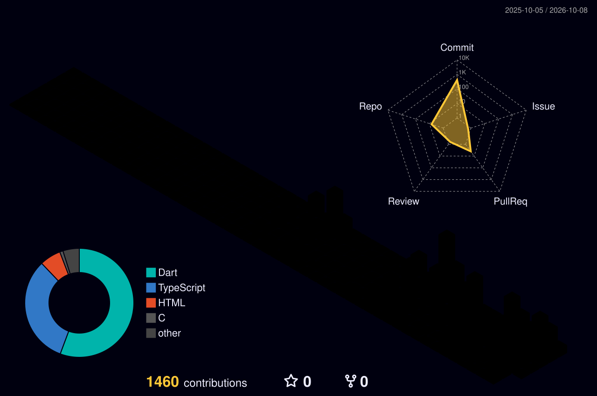

  
  
  

## 👋 Hey, I'm Malik!

I'm a Computer Science student from **Algeria** 🇩🇿.
I build apps that work anywhere, even on a cheap phone with no signal.

- 📱 Mobile apps with **Flutter**
- 🌐 Websites with **Next.js** and **TypeScript** (plus some 3D when I get the chance)
- 🐍 **Python** scripts for the boring jobs
- 🔒 Private work: **Briefing Point Go**, **TechSub** and a few aviation apps. [More on my site](https://malikboudine.vercel.app)
- 🤝 Open to **internships** and **freelance** work
- 📫 **malikboudinee1e@gmail.com**

 

### 🧠 How I build stuff

- 📴 **Offline first.** My apps keep working without internet, and your data stays encrypted on the phone.
- 🌍 **Arabic and French from day one.** Right-to-left layouts included.
- ✅ **Tests must pass.** If it only works on my laptop, it's not done.
- 🐢 **Made for slow phones.** Small, fast and easy on the battery.

### 🎲 Random facts

- I wrote a Wordle solver in C. Yes, that's cheating.
- I also wrote a script that downloads whole YouTube playlists.
- An arrow pointing the wrong way in an Arabic app bugs me way more than it should.

## 🛠️ What I use

<table align="center">
<tr><td align="center" width="150"><b>Languages</b></td><td>
  
</td></tr>
<tr><td align="center"><b>Mobile</b></td><td>
  
  &nbsp;+ Riverpod · Drift · SQLCipher
</td></tr>
<tr><td align="center"><b>Web</b></td><td>
  
  &nbsp;+ GSAP
</td></tr>
<tr><td align="center"><b>Backend</b></td><td>
  
</td></tr>
<tr><td align="center"><b>Tools</b></td><td>
  
</td></tr>
</table>

<b>Learning right now:</b> Flutter architecture · Postgres row-level security · React Three Fiber · more Docker

## 📊 Stats

  

  
  

  
  

  

## 🎮 My commits, but it's a game

<picture>
  <source media="(prefers-color-scheme: dark)" srcset="https://raw.githubusercontent.com/Poasherkir/Poasherkir/arcade/pacman-contribution-graph-dark.svg" />
  <source media="(prefers-color-scheme: light)" srcset="https://raw.githubusercontent.com/Poasherkir/Poasherkir/arcade/pacman-contribution-graph.svg" />
  
</picture>

<picture>
  <source media="(prefers-color-scheme: dark)" srcset="https://raw.githubusercontent.com/Poasherkir/Poasherkir/output/github-snake-dark.svg" />
  <source media="(prefers-color-scheme: light)" srcset="https://raw.githubusercontent.com/Poasherkir/Poasherkir/output/github-snake.svg" />
  
</picture>

  <picture>
    <source media="(prefers-color-scheme: dark)" srcset="./profile-3d-contrib/profile-night-rainbow.svg" />
    <source media="(prefers-color-scheme: light)" srcset="./profile-3d-contrib/profile-green.svg" />
    
  </picture>

  

<b>Thanks for stopping by! Say hi anytime 👋</b>

